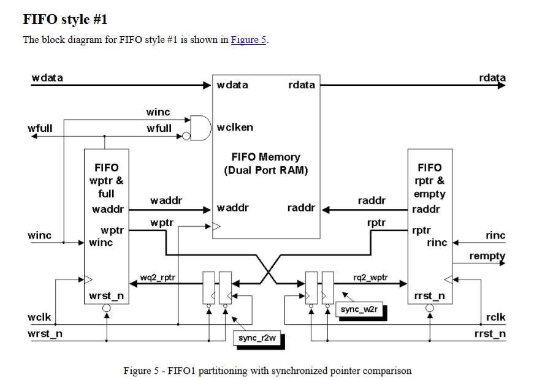
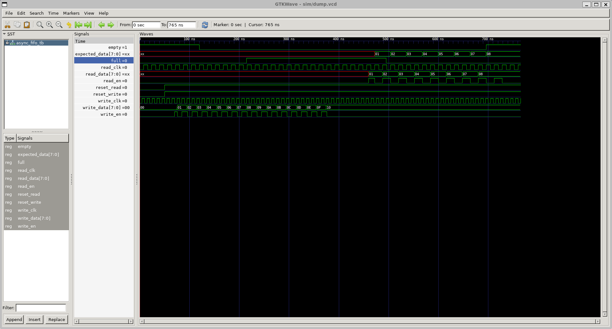

# Asynchronous FIFO Implementation

This repository contains an implementation of an asynchronous FIFO (First-In-First-Out) buffer designed for clock domain crossing applications. This project was created as part of my university coursework in Design Verification, with the aim of implementing and verifying a fundamental digital design component used in multi-clock domain systems.

 

## Project Overview

Asynchronous FIFOs are essential components in digital systems where data must be transferred between different clock domains reliably. This implementation uses gray code pointers to handle the clock domain crossing safely and prevent metastability issues.

### Key Components

1. **Top Module (`top.sv`)**: 
   - The main asynchronous FIFO module that integrates all components
   - Configurable data width and queue size
   - Implements full/empty flags for flow control

2. **Memory Queue (`queue.sv`)**:
   - Storage element for the FIFO data
   - Dual-port memory implementation with separate read and write clocks

3. **Write Pointer Handler (`write_ptr_handler.sv`)**:
   - Manages the write pointer and generates gray-coded signals
   - Handles the full flag generation
   - Includes synchronization logic for the read pointer

4. **Read Pointer Handler (`read_ptr_handler.sv`)**:
   - Manages the read pointer and generates gray-coded signals
   - Handles the empty flag generation
   - Includes synchronization logic for the write pointer

## Simulation Results

The implementation has been tested using a SystemVerilog testbench with basic read/write operations, as shown in the GTKWave capture below:

## Verification Strategy

This project aims to implement progressively more advanced verification methodologies as part of my learning journey in digital design verification:

### Verification Progress Checklist

- [x] RTL design implementation and understanding
- [ ] CRC for error detection and reliability 
- [x] Basic functional testing (conventional testbench)
- [ ] Interface-based verification
- [ ] Implement monitors, checkers, and scoreboard
- [ ] UVM (Universal Verification Methodology) implementation
- [ ] SystemC test implementation

## Tools

- VCS simulator
- GTKWave for viewing waveforms

---
## References

[Simulation and Synthesis Techniques for Asynchronous FIFO Design](http://www.sunburst-design.com/papers/CummingsSNUG2002SJ_FIFO1.pdf#page=17.09)
